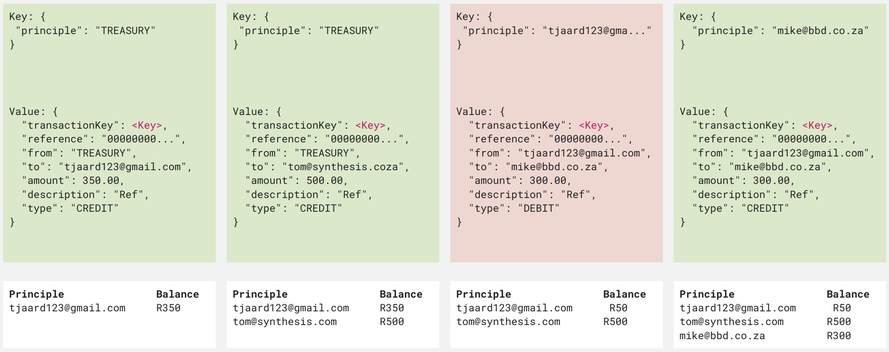

***PS. Code a bit old, this repo's main goal is the README as a reference for Kafka dev***

# Kafka Playground

This is a basic example & reference repo for Kafka using Kotlin and Gradle.  After venturing into microservices you'll soon discover Kafka:

- [Trurning the DB inside-out](https://www.confluent.io/blog/turning-the-database-inside-out-with-apache-samza/)
- [The Data Dichotomy](https://www.confluent.io/blog/data-dichotomy-rethinking-the-way-we-treat-data-and-services/)
- [Example Tutorial](https://medium.com/@stephane.maarek/how-to-use-apache-kafka-to-transform-a-batch-pipeline-into-a-real-time-one-831b48a6ad85)
- [Advanced Tools Comparison](https://medium.com/@stephane.maarek/the-kafka-api-battle-producer-vs-consumer-vs-kafka-connect-vs-kafka-streams-vs-ksql-ef584274c1e)

## Quickstart

```sh
# Kafka dev docker environment courtesy of Landoop
$ docker run --rm --net=host landoop/fast-data-dev

# Option 1 - Docker
$ cd blueprint
$ docker build -t play-kafka/blueprint:1.0.0 .
$ docker run --rm play-kafka/blueprint:1.0.0

# Option 2 - Local (Requires java & gradle)
$ gradle build
$ gradle run
```

**IntelliJ IDEA** works great for Kafka dev

## Local Development

Although you can setup everything you need for kafka on your machine, a great way to get started with Kafka is with a docker image from Landoop:

```sh
$ docker run --rm --net=host landoop/fast-data-dev
```

The [Confluent platform](https://www.confluent.io/download/) is also a brilliant dev environment:

```sh
$ confluent start
```

[Configuring Confluent Control Centre](https://docs.confluent.io/3.3.0/control-center/docs/quickstart.html) on `http://localhost:9021`

To reset your confluent environment:

```sh
$ confluent destroy
$ rm -rf /tmp/kafka-streams
```

## Avro

Avro is a popular tool for data schema's and coupled with Confluent's [schema registry](https://medium.com/@stephane.maarek/introduction-to-schemas-in-apache-kafka-with-the-confluent-schema-registry-3bf55e401321) it's a winner.

## KSQL

- [KSQL Video](https://www.youtube.com/watch?v=FD2z3bdN1Jw) & [Examples](https://github.com/rmoff/quickstart-demos)

Deploy a KSQL server to your cluster or start one locally with the confluent platform.  You can port-forward KSQL server.

```sh
$ confluent start
# OR port-forward
$ kubectl port-forward svc/polaris-kafka-cp-ksql-server 8088  

$ ksql
```

```sql
SET 'auto.offset.reset' = 'earliest';

SHOW topics;
PRINT 'topic-name' FROM BEGINNING;

-- Create streams
CREATE STREAM dogs WITH (KAFKA_TOPIC='dogs', VALUE_FORMAT='AVRO');
CREATE STREAM updates WITH (KAFKA_TOPIC='updates', VALUE_FORMAT='AVRO');

-- Create queries
INSERT INTO updates SELECT 'DOG' AS TYPE, 'CREATE' AS ACTION, NAME AS DATA FROM dogs;
-- This query now runs, it is a continous query, with every append on dogs, updates receives an append

show queries;
```

## Kafka Connect

- [JDBC Connector](https://docs.confluent.io/3.2.0/connect/connect-jdbc/docs/source_connector.html)

PostgreSQL and SQLLite supported out of the box, an example config:

```json
{
  "connection.url": "jdbc:postgresql://localhost:5432/postgres?user=postgres&password=mysecretpassword",
  "connector.class": "io.confluent.connect.jdbc.JdbcSourceConnector",
  "incrementing.column.name": "id",
  "key.converter.schema.registry.url": "http://localhost:8081",
  "key.converter": "io.confluent.connect.avro.AvroConverter",
  "mode": "timestamp+incrementing",
  "name": "JdbcSourceConnector",
  "table.whitelist": "dog",
  "timestamp.column.name": "timestamp",
  "topic.prefix": "sql-",
  "validate.non.null": "false",
  "value.converter.schema.registry.url": "http://localhost:8081",
  "value.converter": "io.confluent.connect.avro.AvroConverter"
}
```

On a cluster you can port-forward the Kafka connect ui:

```sh
$ kubectl port-forward svc/polaris-kafka-kafka-connect-ui 8000 
```

Using PostgreSQL to test locally ([pgweb PostgreSQL web client](https://github.com/sosedoff/pgweb)):

```sh
$ docker run --rm -p 5432:5432 -e POSTGRES_PASSWORD=mysecretpassword -d postgres
$ pgweb --host=localhost --user=postgres --pass=mysecretpassword --listen=5430
```

## Gradle & Kotlin

At the moment the full power of Kafka is only available through the JVM.  I prefer a nice functional language, Kotlin and use Gradle as my package manager and build tool.  You can produce and consume from any language but once you want to do complex joins and avro serialization Kotlin is best.

`build.gradle` packages:

```java
// For kafka streams
//
compile('org.apache.kafka:kafka-streams:2.1.1-cp1')
compile('org.apache.kafka:kafka-clients:2.1.1-cp1')

// Avro and Schema registry
//
compile('io.confluent:kafka-streams-avro-serde:5.1.2')
compile('io.confluent:kafka-avro-serializer:5.1.2')
compile('io.confluent:kafka-schema-registry-client:5.1.2')
compile('io.confluent:monitoring-interceptors:5.1.2')
compile('org.apache.avro:avro:1.8.2')
```

You then have a gradle command `gradle generateAvroJava` to generate POCO's from avro schemas. `gradle build` will also generate Java classes from Avro schemas.

Here's an example of creating a materialized view (`KTable`) of a `KStream` of payments:



```kotlin
val balanceKTable = paymentsStream
        .groupBy({ key, _ ->
            key.getPrinciple() // The principle account holder
        }, Grouped.with(Serdes.String(), payments.valueSerde))
        .aggregate({ 0 }, { _, payment: Payment, balance: Int ->
            if (payment.getType() == "DEBIT")
                balance - payment.getAmount()
            else
                balance + payment.getAmount()
        }, Materialized.with(Serdes.String(), Serdes.Integer()))
```

- `paymentsStream` - A KStream of payment events, top row of image
- `groupBy((key, value) -> groupKey, serdes)` - First parameter is the selector function to key the group by with, in this example it's the principle account holder. **NB**,the second parameter is the serdes for the result.
- `aggregate(() -> initial, (key, value, accumelator) -> result, serdes)` - Sum the amount of all payments, again remember serdes.


**Gotchas / Tricks**

- **ALWAYS** remember to specify the **serdes** for group by, aggregate, joins etc.
- `Ctrl + Shift + P` in IntelliJ shows type of selection
- Get comfortable with IntelliJ, Kotlin intellisense:


The function aggregate has 4 overloads, let's run through the *last* one:
- `initializer: (() -> VR!)!` - First parameter is the initializer function, taking no parameters and returning the first value of the aggregate. `VR` - Value Right
- `aggregator: ((key: K!, value: V!, aggregate: VR!) -> VR!)!` - The aggregator function to be applied to every element. It takes the key, the next value and the result of the previous and returns the new result.
- `materialized` - The serdes of the result, use `Materialized.with(keySerde, valueSerde)`

## Kafka tricks

```sh
# Create topic
bin/kafka-topics.sh --create --zookeeper localhost:2181 --replication-factor 1 --partitions 1 --topic test

# List topics
bin/kafka-topics.sh --list --zookeeper localhost:2181

# Send messages
bin/kafka-console-producer.sh --broker-list localhost:9092 --topic test
This is a message
This is another message

# Produce through csv
cat dogs.csv | kafka-console-producer --broker-list localhost:9092 --topic dogs

# Produce through confluent
confluent produce dogs

# Read topic messages
bin/kafka-console-consumer.sh --bootstrap-server localhost:9092 --topic test --from-beginning

# To create more partitions
kafka-topics --zookeeper cp-kafka-cp-zookeeper:2181 --alter --topic test --partitions 40

#To clear a topic
TOPICS="test test2"
for topic in $TOPICS
do
  echo clearing $topic
  kafka-configs --zookeeper cp-kafka-cp-zookeeper:2181 --alter --entity-type topics --add-config retention.ms=1000 --entity-name $topic
done
sleep 60
for topic in $TOPICS
do
  kafka-configs --zookeeper cp-kafka-cp-zookeeper:2181 --alter --entity-type topics --delete-config retention.ms --entity-name $topic
done
```

## Running Kafka manually

```sh
# Start Zookeeper & Kafka
bin/zookeeper-server-start.sh config/zookeeper.properties
bin/kafka-server-start.sh config/server.properties
```

# Kafka DevOps & other references - very important

https://www.slideshare.net/JeanPaulAzar1/kafka-tutorial-devops-admin-and-ops
https://rmoff.net/2018/08/02/kafka-listeners-explained/